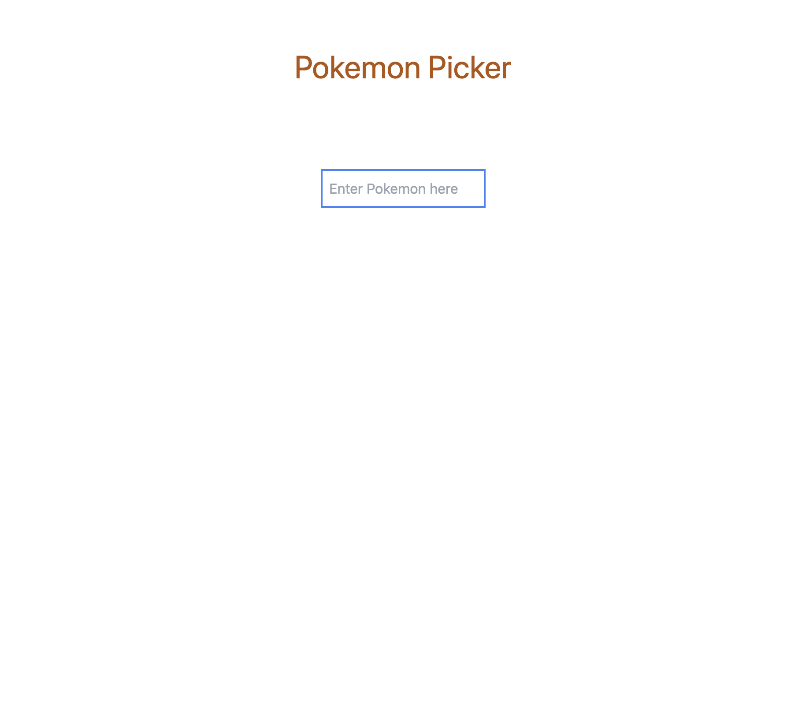
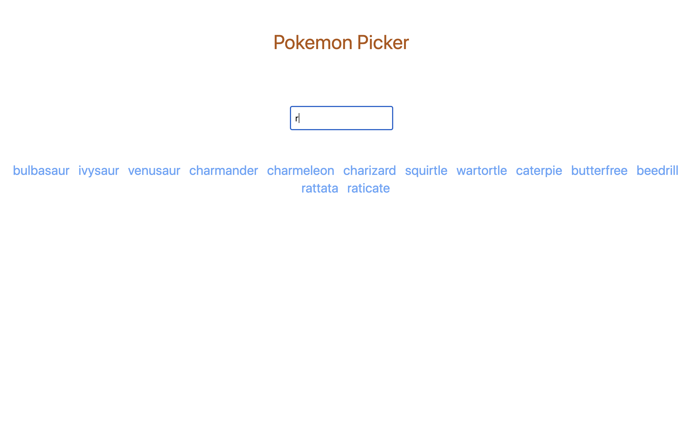
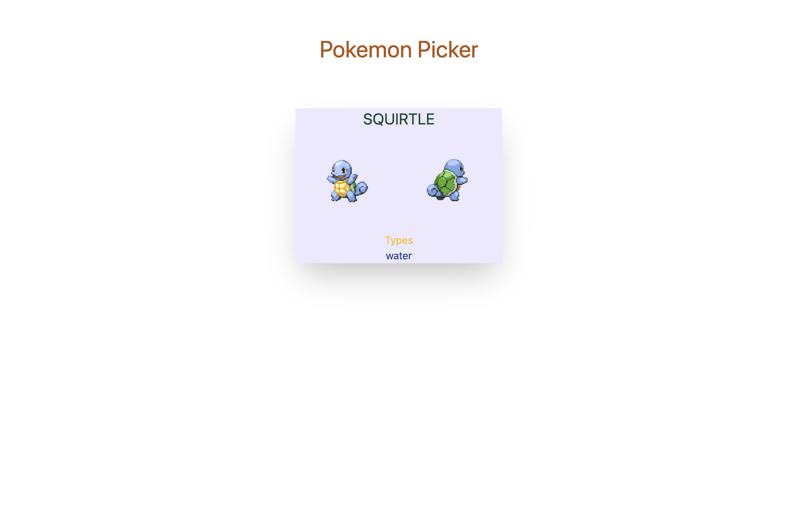

# 토이 프로젝트

## pokemon-app

### 설명

#### 간단한 pokemon picker 사이트 
입력창에 포켓몬 이름을 영어로 입력하면 해당하는 포켓몬 이름 링크가 화면에 출력되고 링크를 클릭하면 poke api에서 제공해주는 포켓몬 이미지가 화면에 출력됩니다. 
상단에 있는 Pokemon Picker링크를 클릭하면 홈 화면으로 다시 이동됩니다.
> poke api가 영어만 제공하므로 영어 검색만 가능합니다.

### 프레임워크 & 라이브러리

- vue3
- vue router
- Tailwind CSS
    [tailwind 공식문서](https://tailwindcss.com/)
- pokeAPI
    [poke api 주소](https://pokeapi.co/)

### npm insall
```
npm install -g @vue/cli
npm install tailwindcss
```

### 프로젝트 구성

> vue-cli를 사용하여 프로젝트 생성 
```
vue create app-name
vue add tailwind
```

📦src
    ┣ 📂assets
    ┃ ┗ 📜tailwind.css
    ┣ 📂components
    ┣ 📂router
    ┃ ┗ 📜index.js
    ┣ 📂views
    ┃ ┣ 📜Home.vue
    ┃ ┗ 📜Pokemon.vue
    ┣ 📜App.vue
    ┗ 📜main.js

### 스크린샷





